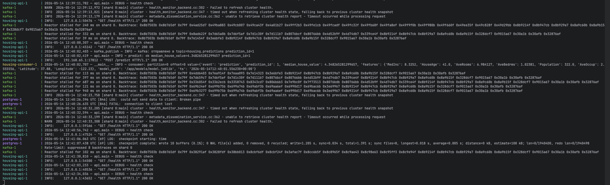
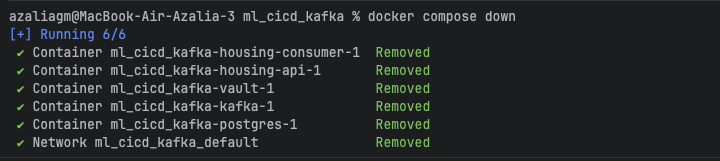
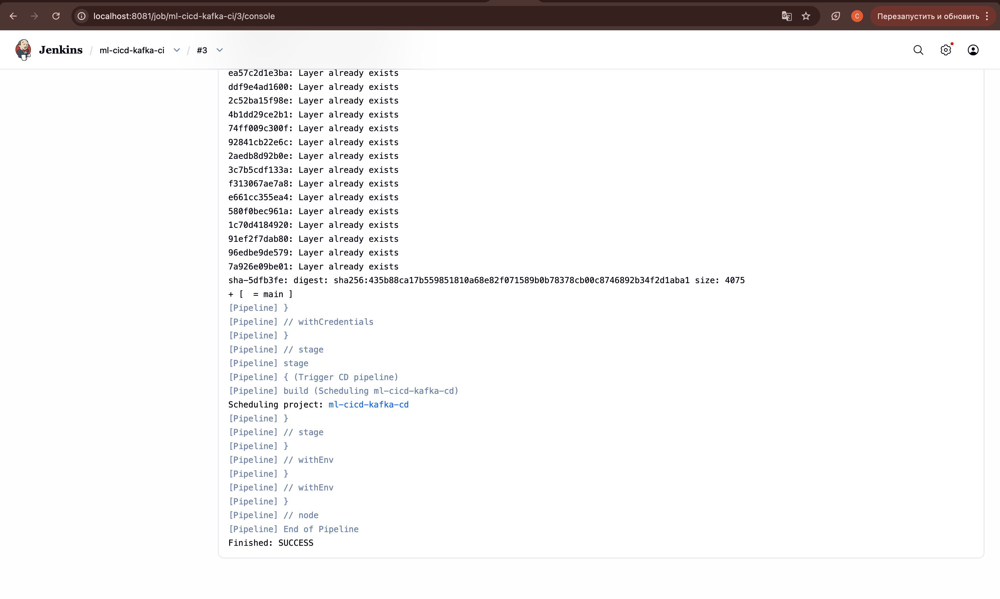
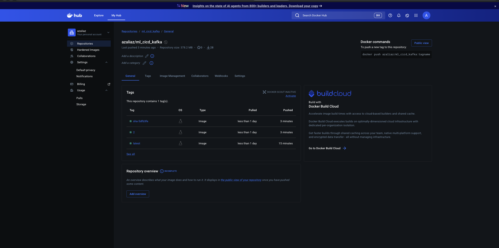
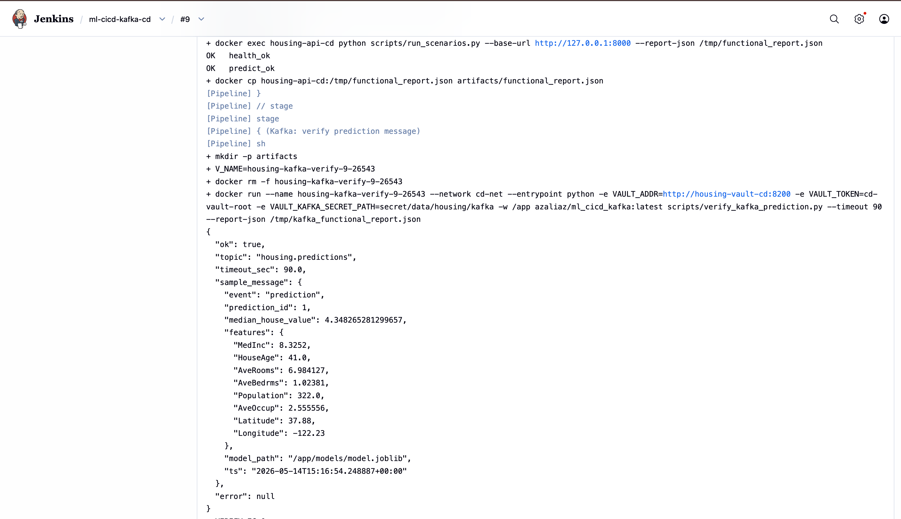
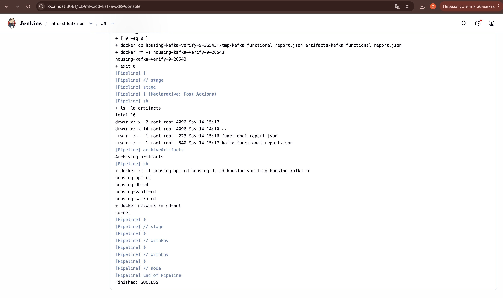
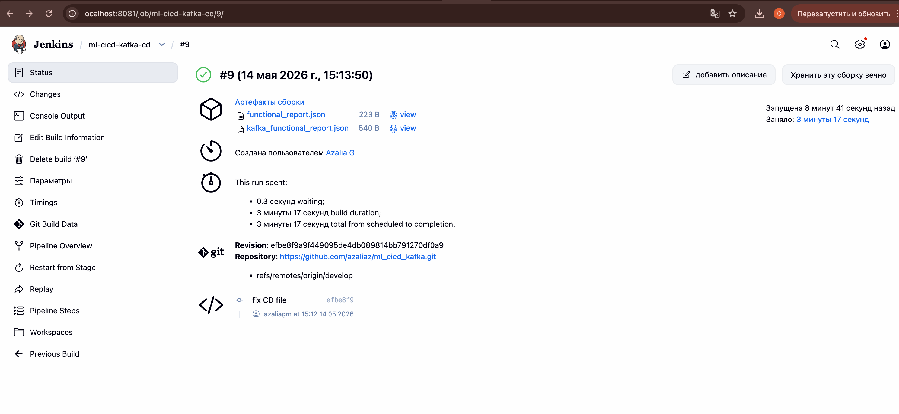
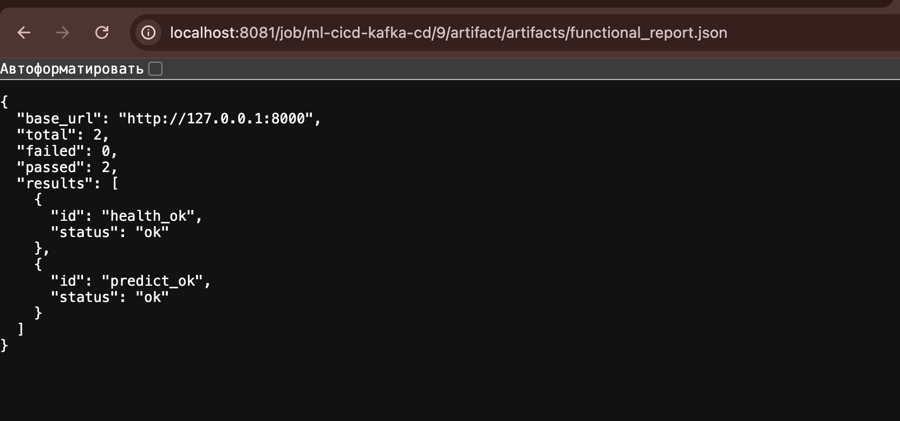
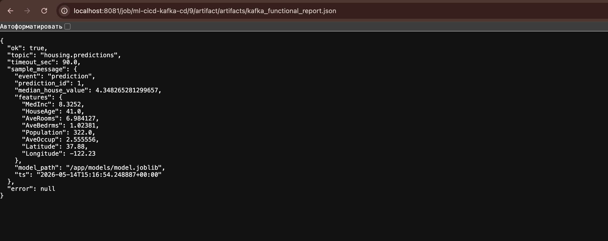

# Лабораторная №4

## 1) Kafka 

### Что сделано

1. **Producer** встроен в сервис модели (`housing-api`): после сохранения предсказания в БД вызывается `publish_prediction_event` из `src/kafka_publish.py` и в топик уходит JSON (событие `prediction`, `prediction_id`, значение, признаки, время и т.д.).
2. **Consumer** вынесен в отдельный контейнер `housing-consumer` в `docker-compose.yml`: тот же образ, что у API, но запускается `python scripts/kafka_consumer.py`; читает топик и пишет сообщения в лог.
3. **Адрес брокера и имя топика** не зашиты в код для compose: Vault при старте кладёт в KV путь `secret/housing/kafka` (`bootstrap_servers`, `topic`) — см. `docker/vault/entrypoint-vault.sh`. API и consumer читают это через `VAULT_KAFKA_SECRET_PATH` (по умолчанию `secret/data/housing/kafka`).
4. **Библиотека** в образе: `kafka-python` в `requirements.txt`.
5. **Проверка в CD**: скрипт `scripts/verify_kafka_prediction.py` убеждается, что после сценария с `predict` в Kafka есть сообщение с `prediction_id`; отчёт сохраняется в `artifacts/kafka_functional_report.json` (на агенте Jenkins файл забирается через `docker cp`, чтобы не зависеть от bind-mount).


## 2)  Docker локально

**Подготовка**

1. Скопировать шаблон окружения: `cp .env.example .env`
2. В `.env` задать пароль БД и при необходимости порты (`HOST_PORT`, `DB_PORT`, `VAULT_PORT`, `KAFKA_HOST_PORT`). Файл `.env` в git не коммитится.

**Запуск**

```
docker compose up --build
```


**Остановка**
```commandline
docker compose down
```


## 3) Jenkins CI 
### Что сделано

Файл пайплайна: **`CI/Jenkinsfile`**.

1. **Забирает код** из репозитория (checkout SCM).
2. **Собирает образ** приложения командой `docker build` в корне репозитория; теги задаются из номера сборки и короткого хеша коммита.
3. **Запускает тесты**: временный контейнер из только что собранного образа выполняет `pytest -q tests`.
4. **Для веток `main` и `develop`** после успешных тестов логинится на Docker Hub (credentials id **`dockerhub`**) и **пушит образ**: теги вида `репозиторий:номер_сборки`, `репозиторий:sha-abcdef`, а также **`репозиторий:latest`**, чтобы CD мог стабильно делать `docker pull …:latest`.
5. **Опционально** (параметр **`TRIGGER_CD`**): ставит в очередь job **CD**, передавая ему имя собранного образа и флаги сценариев. Сам CI **не ждёт** окончания CD.

  


## 4) Jenkins CD

### Что сделано

Файл пайплайна: **`CD/Jenkinsfile`**.

1. **Забирает код** из Git
2. **Скачивает образ приложения** с Docker Hub (`docker pull`), имя образа задаётся параметром **`DOCKER_IMAGE`** (часто `…:latest` или конкретный тег от CI)
3. **Собирает образ Vault** `housing-vault:cd` из `Dockerfile.vault`.
4. **По желанию** (`RUN_PYTEST_IN_CONTAINER`): ещё раз гоняет `pytest` внутри контейнера из образа с Hub
5. **При включённых сценариях** (`RUN_SCENARIOS`): создаёт сеть `cd-net`, поднимает по очереди:
   - **Redpanda** (имя хоста `kafka`) — брокер с Kafka API;
   - **PostgreSQL** — пользователь и пароль из Jenkins credentials **`postgres-app-user`**;
   - **Vault** — в KV записываются те же учётные данные БД и параметры Kafka (`kafka:9092`, топик `housing.predictions`);
   - **контейнер API** с переменными `VAULT_ADDR`, `VAULT_TOKEN`, путями к секретам БД и Kafka, **`SKIP_PREPROCESS_TRAIN=1`** — пароль БД в переменные API **не** передаётся
6. **Ждёт готовность API**: цикл с `curl` на `http://127.0.0.1:8000/health` **внутри** контейнера API (порт на хосте `HOST_PORT` — только проброс снаружи)
7. **Функциональные сценарии**: `scripts/run_scenarios.py` по `scenario.json` пишет **`artifacts/functional_report.json`**
8. **Проверка Kafka** (если не выключено **`RUN_KAFKA_VERIFY`** и не выключены сценарии): запускается `scripts/verify_kafka_prediction.py`; отчёт **`kafka_functional_report.json`** копируется из временного контейнера в `artifacts/` через **`docker cp`**, затем контейнер удаляется
9. **В конце сборки** (`post`): в Jenkins сохраняются артефакты `artifacts/*.json`, все служебные контейнеры и сеть `cd-net` удаляются


  

  




| Путь | Назначение |
|------|------------|
| `api/main.py` | HTTP API, вызов producer после predict |
| `src/kafka_publish.py`, `src/kafka_settings.py` | Отправка в Kafka и настройки из Vault/env |
| `scripts/kafka_consumer.py` | Consumer для compose |
| `scripts/verify_kafka_prediction.py`, `scripts/run_scenarios.py` | Проверки в CD |
| `docker-compose.yml`, `docker/vault/entrypoint-vault.sh` | Локальный стек и сиды Vault |
| `CI/Jenkinsfile`, `CD/Jenkinsfile` | Пайплайны |

